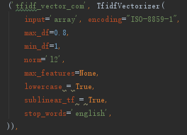
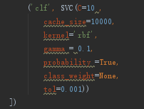
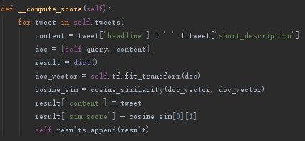

## Welcome to Tweet News Recommender Project

### Introduction

Recently Twitter becomes one of the most popular social media where lots of organizations
publish their news. By analyzing these news, one can obtain valuable data about political,
economic or entertainment trends which stimulate both industry and academic people to
invest money and effort on mining and analyzing Twitter data. Tweets processing and
analysis are also popular topics on Kaggle or other data science related website. However,
since there are millions of tweets being generated and stored each day, it is increasingly
difficult to categorize them and apply analysis on a group. In addition, lots of tweets do not
include accurate tags which also make the analysis harder. In order to make the analysis work
easier, our group decided to build a Python project for News tweets categorization and
recommendation. The core of our project will be a machine learning classifier trained by the
existing large Twitter dataset. The well-trained system should be able to give a relatively
accurate category tag to a new tweet and also be able to provide the most relative tweets
based on a given key words or a query. This categorization and recommendation tool could
be an initial step for further analysis so other data analysts or anyone who interested in
Twitter data could either use our outcome application for data filtering and selection or
embed our code as SDK to their own project.

### Tweets News Format Sample

### Classifier Algorithm: Support Vector Machine(SVM)
In machine learning, support-vector machines (SVMs, also support-vector networks) are supervised learning models with associated learning algorithms that analyze data used for classification and regression analysis. Given a set of training examples, each marked as belonging to one or the other of two categories, an SVM training algorithm builds a model that assigns new examples to one category or the other, making it a non-probabilistic binary linear classifier (although methods such as Platt scaling exist to use SVM in a probabilistic classification setting). An SVM model is a representation of the examples as points in space, mapped so that the examples of the separate categories are divided by a clear gap that is as wide as possible. New examples are then mapped into that same space and predicted to belong to a category based on the side of the gap on which they fall.[More Detailed](https://en.wikipedia.org/wiki/Support-vector_machine)
 In our case, we use scikit-learn package to handle the document vectorazation and SVM training. 
#### Document Vectorization

#### SVM Model

### Recommendation Algorithm: Item-based Consine Similarity
Cosine similarity is a measure of similarity between two non-zero vectors of an inner product space that measures the cosine of the angle between them. The cosine of 0° is 1, and it is less than 1 for any angle in the interval (0, π] radians. It is thus a judgment of orientation and not magnitude: two vectors with the same orientation have a cosine similarity of 1, two vectors oriented at 90° relative to each other have a similarity of 0, and two vectors diametrically opposed have a similarity of -1, independent of their magnitude. The cosine similarity is particularly used in positive space, where the outcome is neatly bounded in [0,1]. The name derives from the term "direction cosine": in this case, unit vectors are maximally "similar" if they're parallel and maximally "dissimilar" if they're orthogonal (perpendicular). This is analogous to the cosine, which is unity (maximum value) when the segments subtend a zero angle and zero (uncorrelated) when the segments are perpendicular.[More Detailed](https://en.wikipedia.org/wiki/Cosine_similarity)
 In our case, we use scikit-learn package to handle the document vectorazation and Consine Similarity calculation.
#### Consine Similarity Calculation

