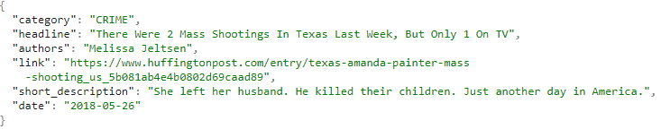

## Welcome to Tweet News Recommender Project

### Introduction

Recently Twitter becomes one of the most popular social media where lots of organizations
publish their news. By analyzing these news, one can obtain valuable data about political,
economic or entertainment trends which stimulate both industry and academic people to
invest money and effort on mining and analyzing Twitter data. Tweets processing and
analysis are also popular topics on Kaggle or other data science related website. However,
since there are millions of tweets being generated and stored each day, it is increasingly
difficult to categorize them and apply analysis on a group. In addition, lots of tweets do not
include accurate tags which also make the analysis harder. In order to make the analysis work
easier, our group decided to build a Python project for News tweets categorization and
recommendation. The core of our project will be a machine learning classifier trained by the
existing large Twitter dataset. The well-trained system should be able to give a relatively
accurate category tag to a new tweet and also be able to provide the most relative tweets
based on a given key words or a query. This categorization and recommendation tool could
be an initial step for further analysis so other data analysts or anyone who interested in
Twitter data could either use our outcome application for data filtering and selection or
embed our code as SDK to their own project.

### Tweets News Format

### Jekyll Themes

Your Pages site will use the layout and styles from the Jekyll theme you have selected in your [repository settings](https://github.com/Zwitterion01/525Final/settings). The name of this theme is saved in the Jekyll `_config.yml` configuration file.

### Support or Contact

Having trouble with Pages? Check out our [documentation](https://help.github.com/categories/github-pages-basics/) or [contact support](https://github.com/contact) and we’ll help you sort it out.
